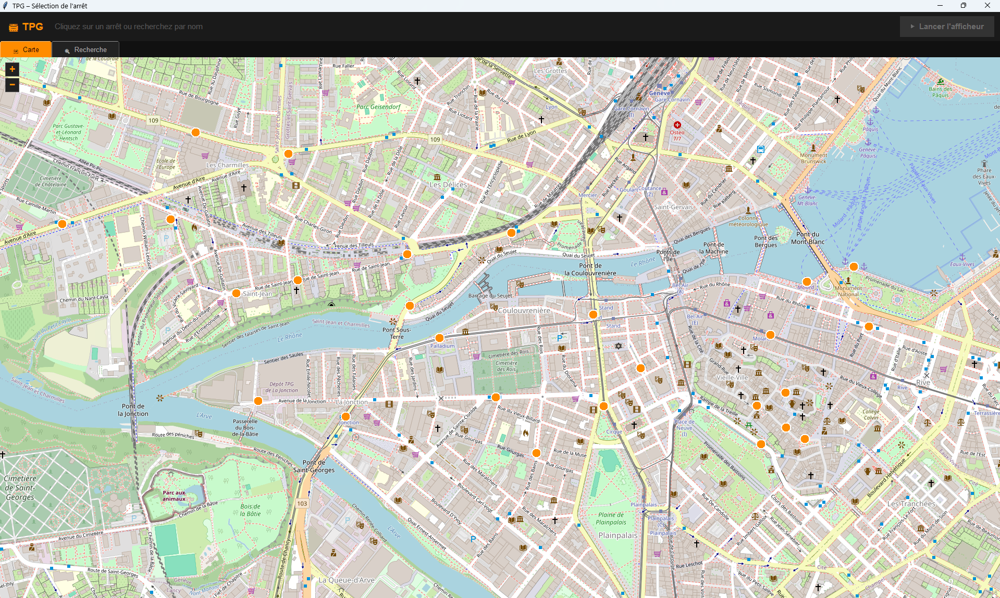
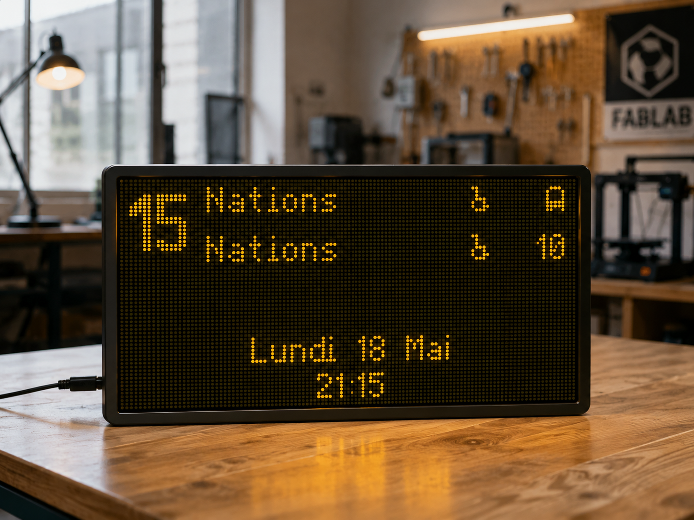

# 🚋 TPG Display — Panneau d'arrêt sur écran

Reproduit fidèlement l'affichage des panneaux d'arrêt TPG (Transports Publics Genevois) sur n'importe quel écran. Rendu dot-matrix authentique, données en temps réel, sélection de l'arrêt sur carte interactive.

| Sélecteur d'arrêt | Panneau LED |
|:-----------------:|:-----------:|
|  |  |

---

## ✨ Fonctionnalités

- **Carte interactive** — sélection de l'arrêt et du quai directement sur une carte OpenStreetMap
- **Rendu dot-matrix authentique** — fonte et proportions extraites pixel par pixel des vrais panneaux TPG
- **Toutes les lignes** — affiche tous les départs de l'arrêt sélectionné, groupés par ligne
- **2 départs par ligne** — numéro centré entre les deux destinations, comme le vrai panneau
- **Données en temps réel** — via l'API open source [transport.opendata.ch](https://transport.opendata.ch)
- **Plein écran adaptatif** — remplit exactement l'écran sans bandes noires, quel que soit le ratio
- **Icônes authentiques** — fauteuil roulant et tram extraits des grilles CSV originales
- **Optimisé Raspberry Pi** — rendu différentiel, seuls les pixels modifiés sont redessinés
- **Mode simulation** — pour tester sans réseau

---

## 🚀 Installation en une commande

### Raspberry Pi / Linux

```bash
git clone https://github.com/ccachin/TPG.git
cd TPG
bash install.sh
```

### Windows

```
git clone https://github.com/ccachin/TPG.git
cd TPG
install.bat
```

Le script installe automatiquement toutes les dépendances, crée un raccourci sur le bureau, et propose le démarrage automatique sur Raspberry Pi.

---

## ▶ Utilisation

1. Lancer `tpg_selector.py` (ou double-cliquer sur le raccourci bureau)
2. Naviguer sur la carte et cliquer sur un arrêt
3. Choisir le bon côté de la route (quai orange ou bleu)
4. L'afficheur se lance avec toutes les lignes de ce quai

---

## ⌨️ Raccourcis clavier

| Touche | Action |
|--------|--------|
| `F11` ou `F` | Basculer plein écran |
| `S` | Retour au sélecteur d'arrêt |
| `Échap` | Quitter le plein écran |

---

## ⚙️ Configuration

En haut de `tpg_led.py` :

```python
SHOW_WHEELCHAIR = True   # Icône fauteuil roulant
DOT_RATIO       = 0.72   # Taille des LEDs
REFRESH_S       = 30     # Rafraîchissement API (secondes)
```

### Mode simulation

```python
SIMULATE = True
SIM_DEPS = [
    {"mins": 17, "delay": 0, "line": "14", "dest": "Bernex-Vailly"},
    {"mins": 35, "delay": 0, "line": "14", "dest": "Bernex-Vailly"},
    {"mins": 29, "delay": 0, "line": "18", "dest": "Palettes"},
    {"mins": 39, "delay": 0, "line": "18", "dest": "Palettes"},
]
```

---

## 📁 Fichiers

| Fichier | Rôle |
|---------|------|
| `tpg_selector.py` | Sélection de l'arrêt sur carte — **point d'entrée** |
| `tpg_led.py` | Afficheur LED dot-matrix |
| `install.sh` | Installation automatique Linux/Pi |
| `install.bat` | Installation automatique Windows |
| `start.sh` | Lancement rapide (créé par install.sh) |

---

## 🔌 API

[transport.opendata.ch](https://transport.opendata.ch) — gratuite, sans clé d'authentification.

---

## 🖥 Testé sur

- Raspberry Pi 400 (Raspberry Pi OS)
- Windows 11

---

## 🏗 Architecture

```
tpg_selector.py   Carte OSM native (tkinter Canvas + Pillow)
    │              Sélection arrêt → quai → lance tpg_led.py
    ▼
tpg_led.py        Afficheur LED
    ├── THICK      Fonte épaisse 7-8×13 (numéros de ligne)
    ├── FONT_TPG   Fonte 4×7 (destinations, extraite des panneaux réels)
    ├── FONT       Fonte 5×7 (date, heure)
    ├── LEDCanvas  Rendu différentiel (begin_frame / commit_frame)
    └── TPGWindow  Plein écran adaptatif (step_x ≠ step_y)
```

---

## 📄 Licence

MIT

---

*Projet personnel inspiré des vrais panneaux d'arrêt TPG de Genève.*